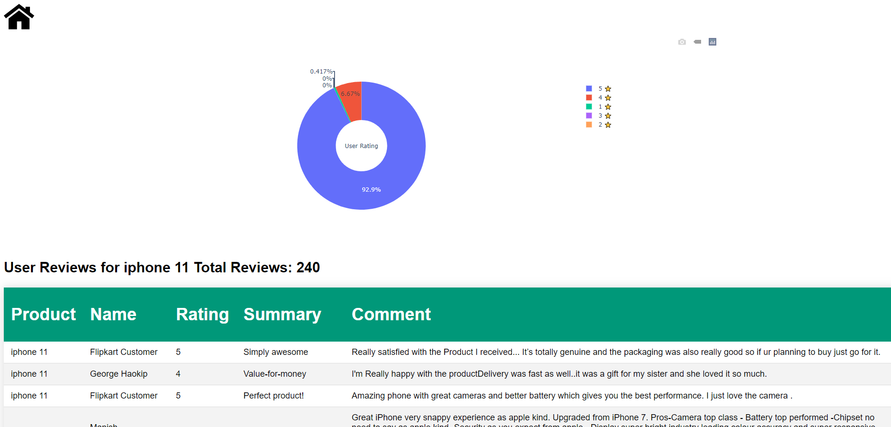

# ReviewScraper
Scrape the product reviews and store them in a database.

## Table of Contents
* [General Info](#general-information)
* [Features](#features)
* [Screenshots](#screenshots)
* [Setup](#setup)
* [Usage](#usage)
* [Room for Improvement](#room-for-improvement)
* [Contact](#contact)
* [License](#license)


## General Information
- This project scrapes the reviews of the products from Flipkart and stores them in a database to avoid scraping for the same product at a later point in time.


## Features
- Provides user interface 
- Interactive graphical representation of ratings


## Screenshots



## Setup
Clone this repo using
```sh
git clone https://github.com/Anil-45/ReviewScraper.git
```

Install the required modules using
```sh
pip install -r Requirements.txt
```


## Usage
Example usage:

```bash
python app.py
```

Open [http://127.0.0.1:5000/](http://127.0.0.1:5000/)

You can find all the logs in `.log` files

## Room for Improvement
- Add support for different databases.
- Add config file for database credentials.

## Contact
Created by [@Anil_Reddy](https://github.com/Anil-45/) 

## License
This project is available under the [MIT](https://github.com/Anil-45/ReviewScraper/blob/main/LICENSE).
